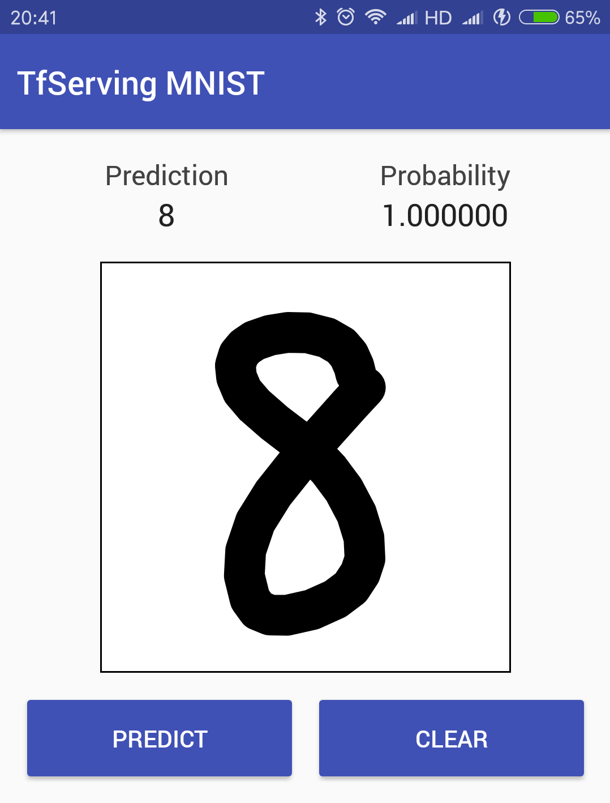

# TensorFlow Serving MNIST

This project demonstrates how to use [TensorFlow Serving](https://www.tensorflow.org/serving/) for handwritten digits classification from MNIST.

<div align="center">
  
</div>

This project includes:

- Model training and exporting
- Serve the model through [gRPC](https://grpc.io/) by using TensorFlow Serving
- Provide RESTful API for classification by a [Express.js](https://expressjs.com/) server
- An Android/iOS App built by [React Native](https://facebook.github.io/react-native/)

## How to build from scratch

### Requirement

- TensorFlow 1.6.0, Python 3.6
- Node.js 8.11.1
- React Native 0.54

### Step 1. Model Training

The model is defined in [train.py](https://github.com/nex3z/tfserving-mnist/blob/master/train.py). Run the following command to train the model.

```
python train.py --model_dir ./saved_model --iterations 10000
```

After training, a collection of checkpoint files will be generated in `./saved_model`.

You can test the model on test set using the command below.

```
python test.py --model_dir ./saved_model
```

### Step 2. Export the model

The tained model needs to be exported for TensorFlow Serving to use. Run the following command to export the model.

```
python export.py --model_dir ./saved_model --version 1 --export_dir ./export
```

In the export directory, a folder will be created with the name of the version number, for example `/export/1`, in which you will find the exported model files.

### Step 3. Start TensorFlow Server

Install TensorFlow Serving by following the [instructions](https://www.tensorflow.org/serving/setup). Make sure you can run the `tensorflow_model_server` command in terminal. 

Run the `run_tf_server.sh` to start the TensowFlow server.

```
./run_tf_server.sh
```

### Step 4. Start Express.js Server

There is a Express.js server in `rest_server` directory which provides RESTful API for client. 

In `rest_server` directory, change the value of `config.tf_server` in [config.js](https://github.com/nex3z/tfserving-mnist/blob/master/rest_server/config.js) to the TensorFlow server address. You can test the server to check if everything is properly set up by running `npm test`. Then start the server.

```
node app.js
```

### Step 5. Build and run the app

The mobile app client in located in `app` directory.

In `app` directory, change the value of `config.rest_server` in [config.js](https://github.com/nex3z/tfserving-mnist/blob/master/app/config.js) to the Express.js server address. Then build and run the app.

```
react-native run-android
```
